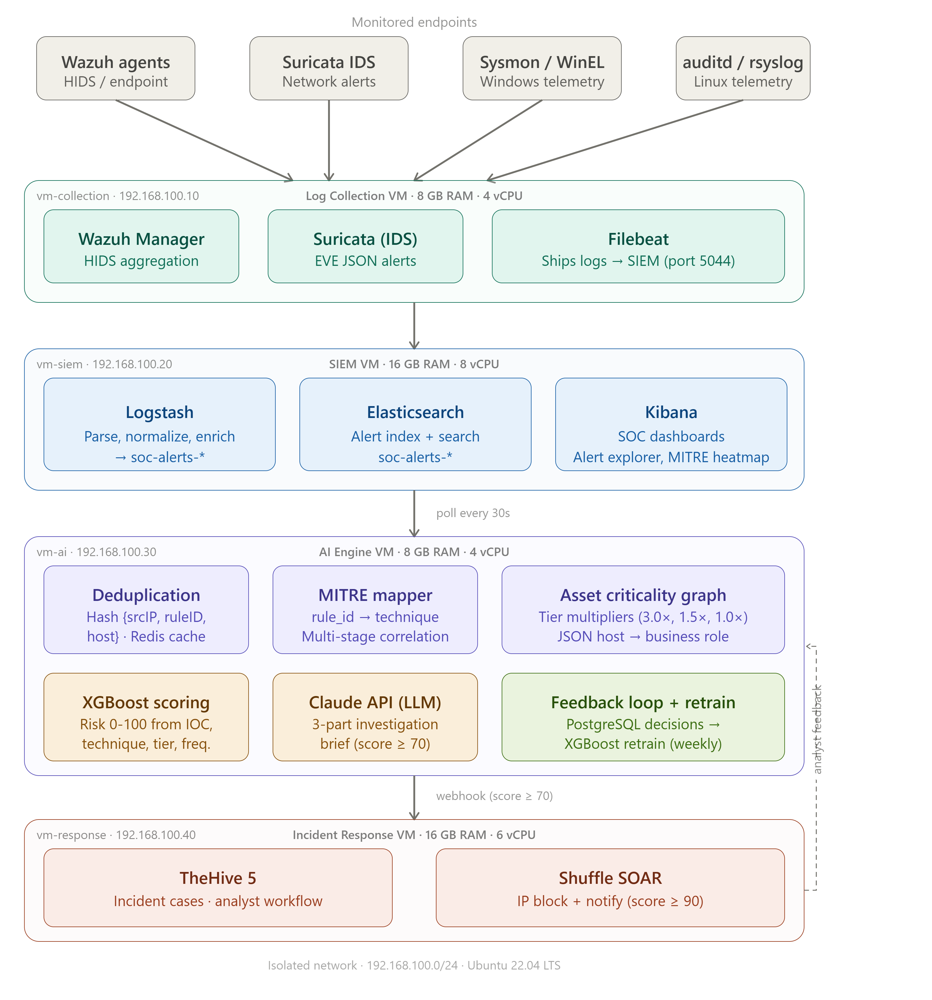

# Self-Calibrating SOC Platform

**AI-Powered Alert Prioritization and Automated Incident Response with Analyst Feedback Learning**

This project implements a fully open-source SOC platform that ingests alerts from Wazuh, Suricata, Sysmon, and Linux telemetry; normalizes them through the ELK stack; scores incidents with an XGBoost model; generates LLM investigation guidance; and automates response through Shuffle SOAR and TheHive.

<strong>98.2%</strong>Alert volume reduction after deduplication

<strong>83%</strong>MITRE ATT&CK coverage across observed alert types

<strong>0.84</strong>XGBoost precision after feedback retraining

<strong>4.1s</strong>Average TheHive case creation latency

## What the Platform Demonstrates

- Multi-source alert collection with Wazuh, Suricata, Sysmon, auditd, and Filebeat.
- ELK-based indexing, search, visualization, and dashboarding.
- Fingerprint-based deduplication that collapses repeated alerts into incidents.
- MITRE ATT&CK mapping and multi-stage attack correlation.
- Asset-aware XGBoost risk scoring on a 0-100 scale.
- Locally-hosted LLM (Ollama/phi3) investigation guidance for L1 analysts.
- Shuffle SOAR playbooks for TheHive case creation and critical-score isolation.
- Analyst feedback learning through PostgreSQL and weekly model retraining.

## Technology Stack

| Layer | Tools |
| --- | --- |
| Log collection | Wazuh Manager and Agents, Suricata, Sysmon, auditd |
| Transport and normalization | Filebeat, Logstash |
| SIEM | Elasticsearch, Kibana |
| AI engine | Python, Redis, PostgreSQL, XGBoost, Ollama (phi3) |
| Response | TheHive 5, Shuffle SOAR, Wazuh active response |
| Documentation | MkDocs Material |

!!! success "Project Outcome"
    The platform validates the full detection-to-response path: raw telemetry becomes normalized alerts, alerts become scored and deduplicated incidents, high-risk incidents become TheHive cases, and analyst decisions feed the next scoring cycle.
