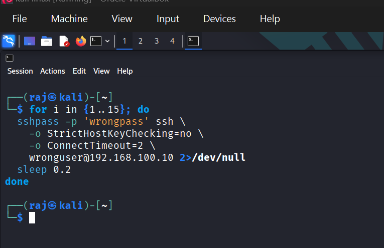
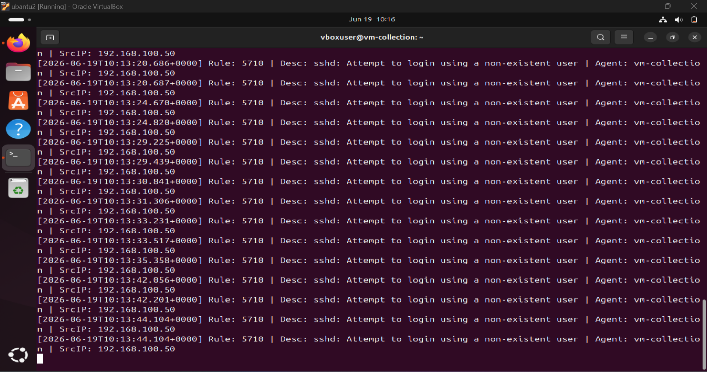
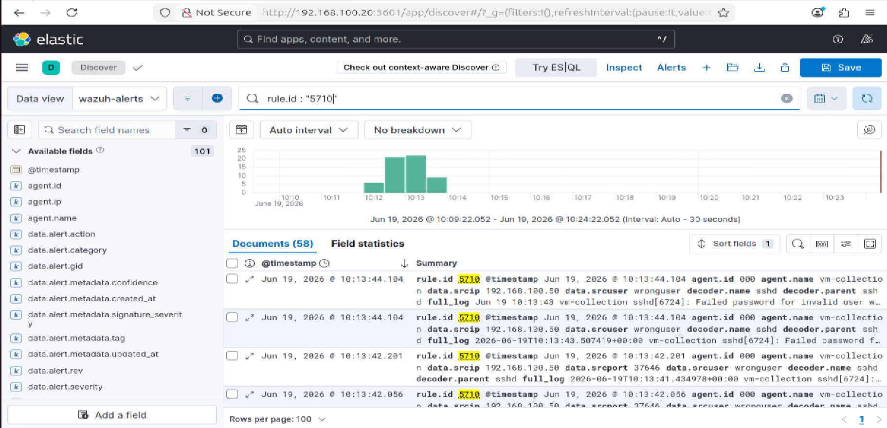
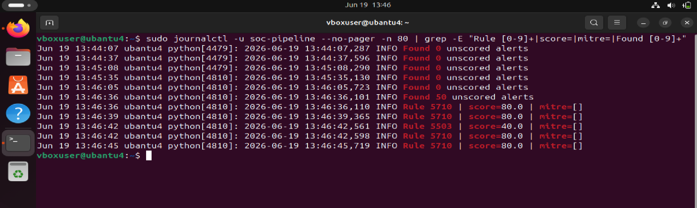
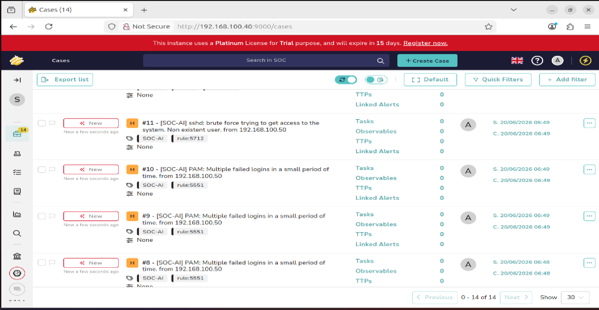

# Phase 1: Pipeline Smoke Test

**Window:** Day 1

**Goal:** Prove that a real alert travels from collection through scoring into TheHive.

## Validation Steps

- Generate SSH brute-force activity from a separate host.
- Confirm Wazuh detects the event and Elasticsearch indexes it.
- Verify risk_score and mitre_techniques fields are added by vm-ai.
- Confirm Shuffle creates a TheHive case when the score crosses the threshold.

## Result

The end-to-end path was validated: raw alert -> indexed event -> enriched/scored incident -> TheHive case.

## Evidence Screenshots

*Figure 1 - SSH brute-force simulation, Kali*

*Figure 2 - Wazuh Manager detecting Rule 5710*

*Figure 3 - Kibana Discover soc-alerts index*

*Figure 4 - SOC AI pipeline logs, risk_score=90, T1110*

*Figure 5 - TheHive Cases dashboard auto-created*

