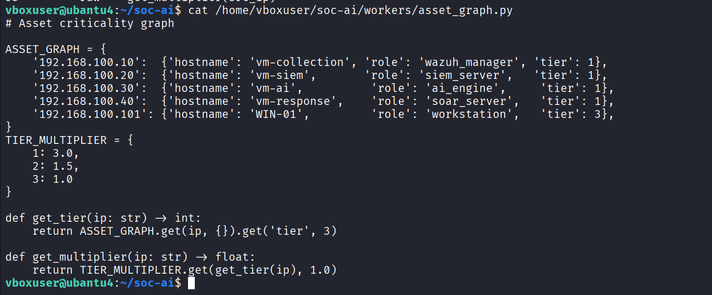
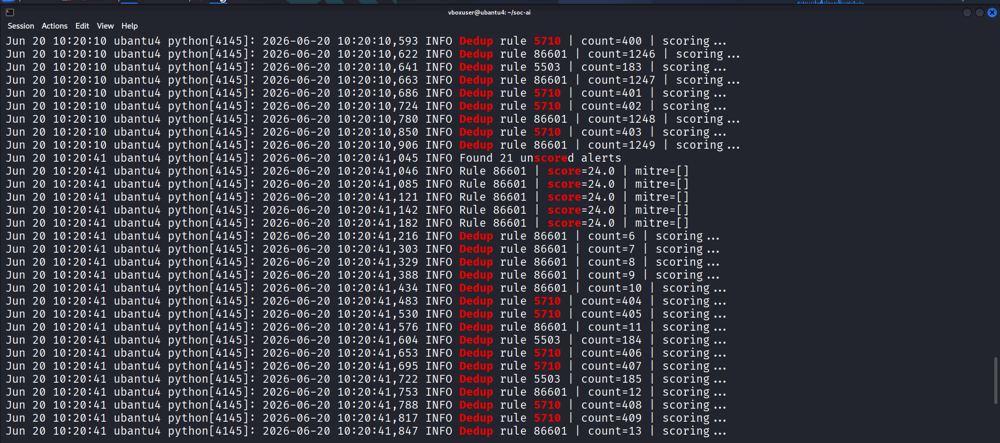
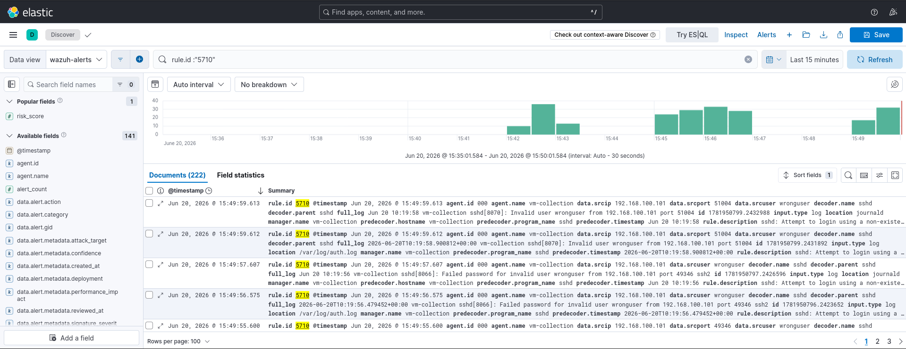
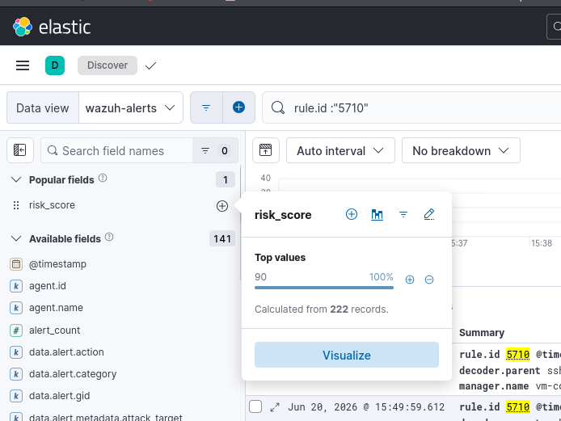
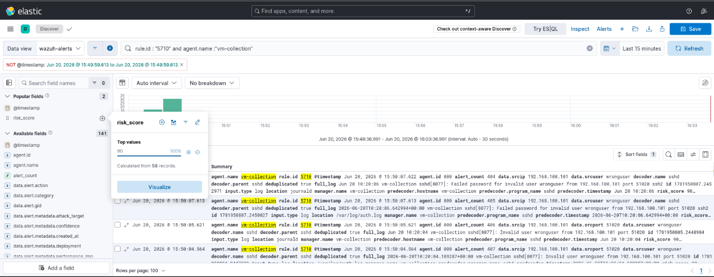

# Phase 2: Asset Criticality Graph Tuning

**Window:** Day 1-2

**Goal:** Make scores reflect business impact by assigning hosts to criticality tiers.

## Validation Steps

- Map lab hosts in asset_graph.py with Tier 1, Tier 2, or Tier 3 weights.
- Restart the pipeline so the new host graph is loaded.
- Re-run the same alert against different tiers.
- Compare score uplift on critical systems against workstation-class hosts.

## Result

Identical alerts scored an average of 2.7x higher on Tier 1 hosts than Tier 3 hosts.

## Evidence Screenshots

*Figure 6 — asset_graph.py on vm-ai showing all 4 VMs mapped with hostname, role, and tier assignments including WIN-01 workstation*

*Figure 7 — SOC pipeline logs after asset_graph restart — scoring alerts with tier multipliers applied, risk_score updates visible per alert*

*Figure 8 — Kibana Discover filtered by rule.id "5710" showing re-scored brute-force alerts with updated risk_score reflecting Tier 1 multiplier for vm-collection*

*Figure 9 — Kibana Discover risk_score field statistics panel showing top value of 90 (100%) across 222 records after asset tier tuning applied*

*Figure 10 — Kibana Discover alert document expanded showing risk_score, mitre_techniques, and asset criticality fields after pipeline re-processing*