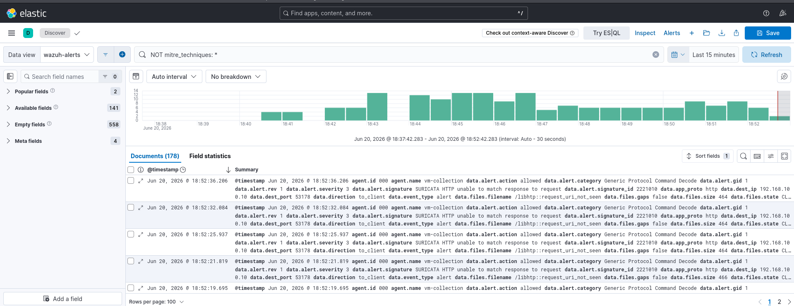
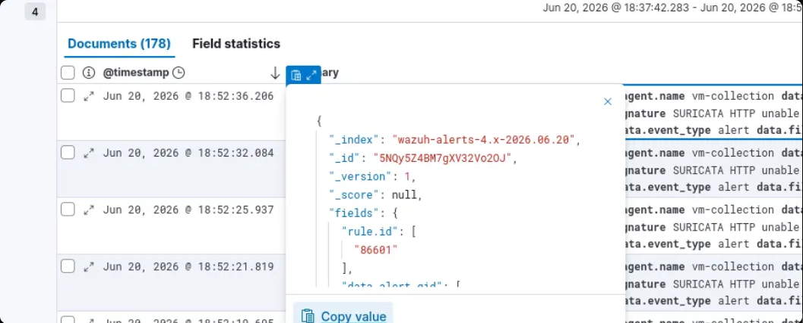
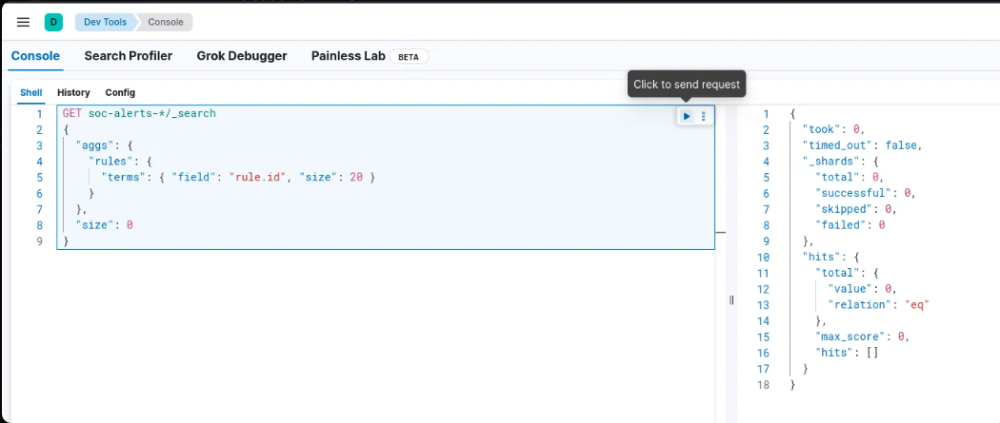
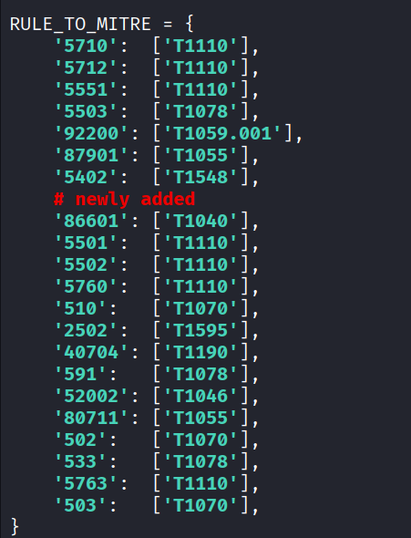
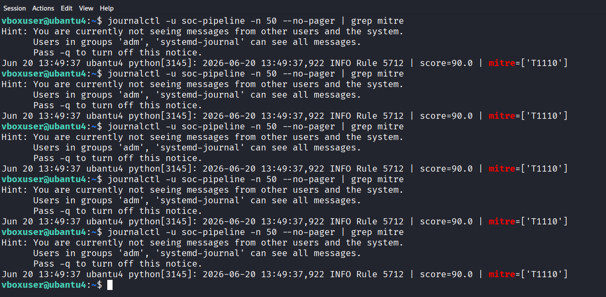
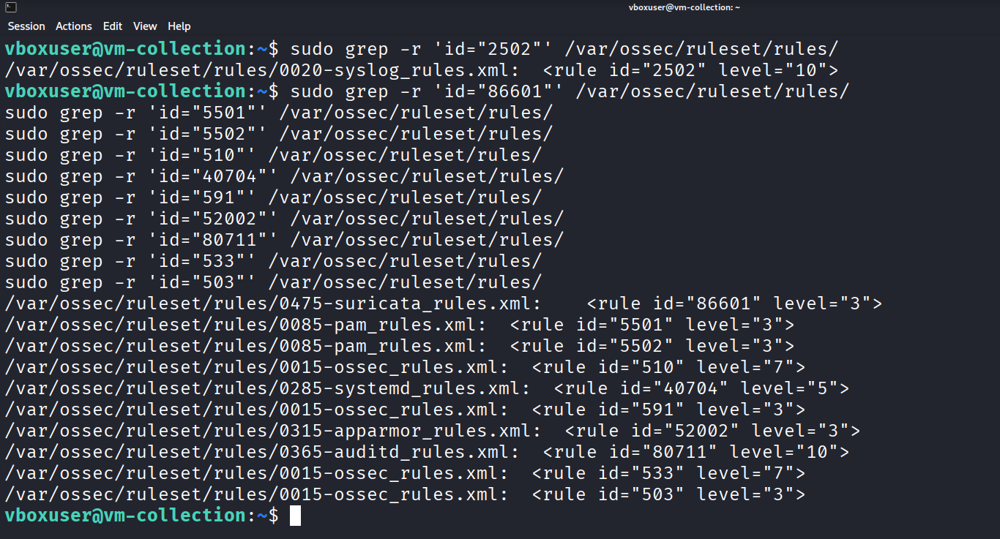
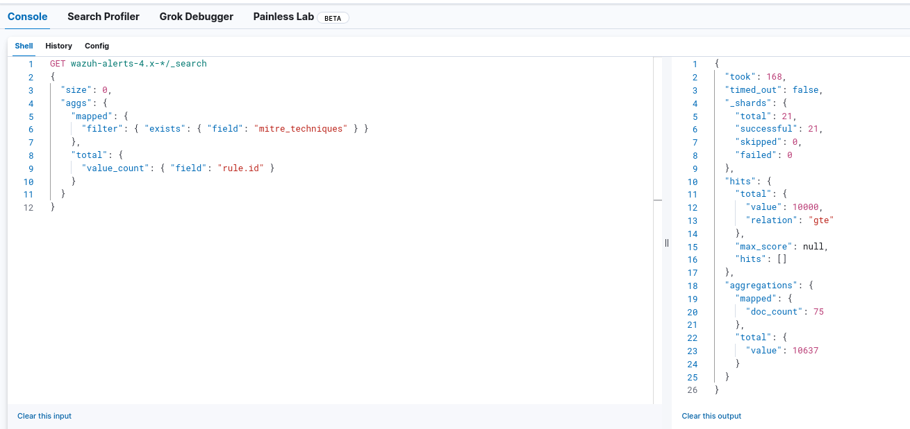
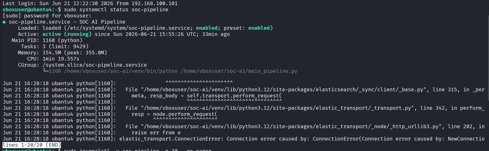
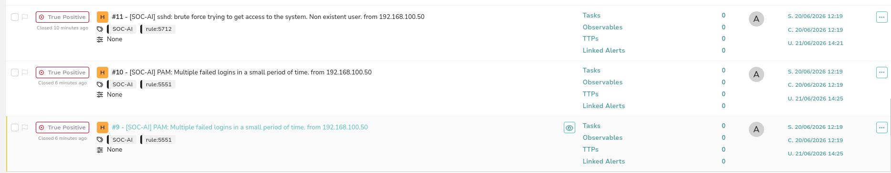

# Phase 3: MITRE ATT&CK Coverage Expansion

**Window:** Week 1

**Goal:** Map observed Wazuh and Suricata alerts to MITRE techniques for better correlation.

## Validation Steps

- Query Kibana for alerts with missing technique mappings.
- Extend the RULE_TO_MITRE dictionary for high-volume rule IDs.
- Validate mapped Wazuh and Suricata events in Elasticsearch.
- Track MITRE coverage until it crosses the 80 percent target.

## Result

MITRE technique coverage reached 83 percent of observed alert types.

## Evidence Screenshots

*Figure 11 — Kibana Discover filtering NOT mitre_techniques to find unmapped alerts; documents visible with no MITRE technique field showing coverage gaps*

*Figure 12 — Kibana Discover expanded alert document JSON showing index, version, and fields including rule.id used to identify unmapped Wazuh rule IDs*

*Figure 13 — Kibana Dev Tools aggregation query on soc-alerts grouping by rule.id to find top unmapped rule IDs*

*Figure 14 — mitre_mapper.py RULE_TO_MITRE dictionary updated with newly added rule IDs mapped to techniques T1040, T1070, T1595, T1190, T1046, T1055, T1078*

*Figure 15 — Pipeline logs after MITRE mapper update showing alerts now scored with mitre=[T1110] tags populated for SSH brute-force rule 5712*

*Figure 16 — vm-collection terminal grep searching Wazuh ruleset XML files for rule IDs to confirm descriptions and find correct MITRE mappings*

*Figure 17 — Kibana Dev Tools aggregation query on mitre_techniques field and rule.id to measure MITRE coverage percentage across all indexed soc-alerts documents*

*Figure 18 — vm-ai terminal systemctl status soc-pipeline showing service active/running after MITRE mapper changes with recent log lines confirming normal operation*

*Figure 19 — TheHive Cases list showing multiple cases with MITRE technique tags (T1110, T1040) visible in case titles after expanded mapping pushed through the pipeline*