# Phase 4: Analyst Feedback Loop

**Window:** Week 1-2

**Goal:** Feed TheHive analyst decisions into PostgreSQL so XGBoost can retrain on local reality.

## Validation Steps

- Close cases with accurate TruePositive, FalsePositive, or Duplicate resolution.
- Run or wait for the feedback poller to write analyst decisions to PostgreSQL.
- Reach the minimum decision threshold for retraining.
- Run retrain.py and compare scores before and after calibration.

## Result

After 51 decisions, XGBoost retraining completed with accuracy 0.73 and model saved to models/xgb_model.pkl.

## Evidence Screenshots

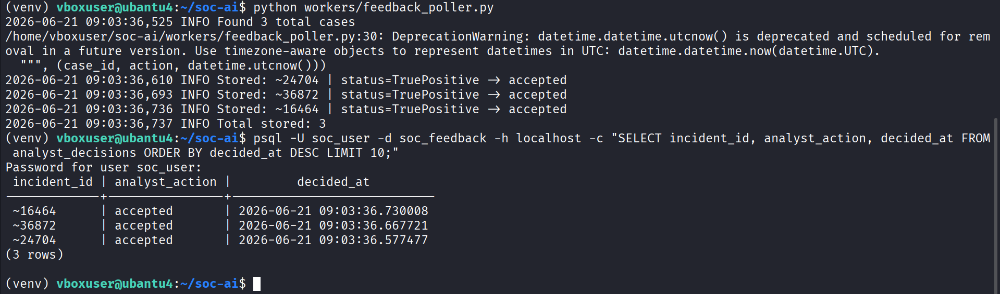

*Figure 20 — vm-ai terminal running feedback_poller.py manually; output showing 3 total cases found and analyst decisions (TruePositive=accepted) written to PostgreSQL analyst_decisions table*

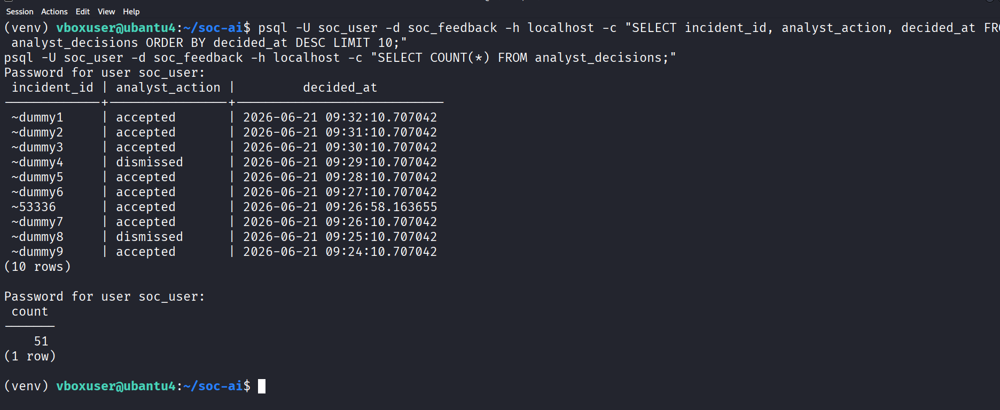

*Figure 21 — PostgreSQL query on vm-ai SELECT on analyst_decisions table showing incident_id, analyst_action (accepted/dismissed), and decided_at timestamps; COUNT(*) returns 9 rows*

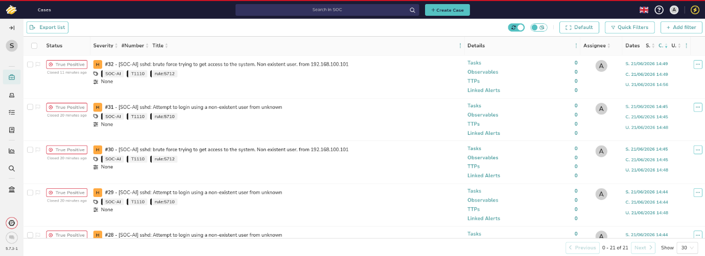

*Figure 22 — Shuffle SOAR dashboard showing workflow executions list with Status, Severity, and Title panels with active cases triggered from the AI pipeline webhook*

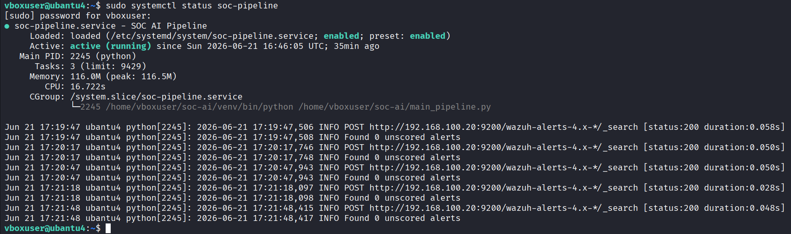

*Figure 23 — vm-ai terminal systemctl status soc-pipeline confirming pipeline active/running, followed by live log output showing HTTP POST scoring requests sent to Elasticsearch every 30 seconds*

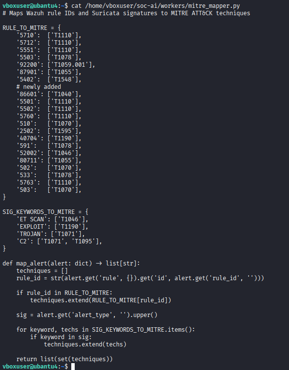

*Figure 24 — mitre_mapper.py full file showing complete RULE_TO_MITRE and SIG_KEYWORDS_TO_MITRE dictionaries with all mapped rules plus map_alert() function logic*

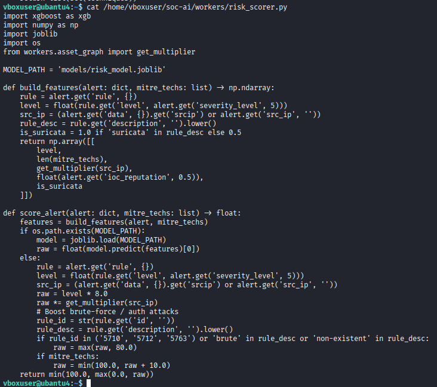

*Figure 25 — risk_scorer.py on vm-ai showing build_features() and score_alert() functions including asset tier multiplier logic, XGBoost model load, and heuristic fallback scoring*

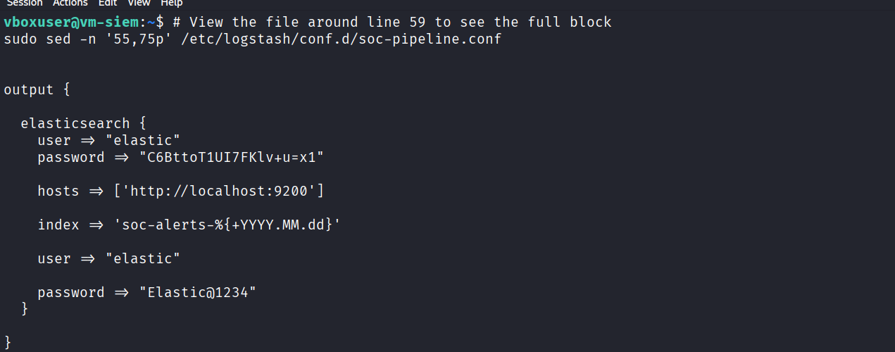

*Figure 26 — vm-siem terminal Logstash soc-pipeline.conf output block showing Elasticsearch credentials added after xpack.security was enabled*

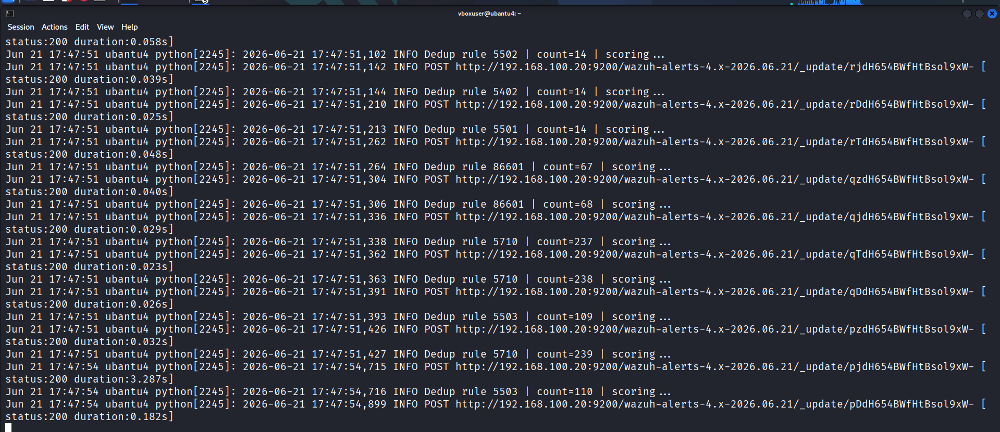

*Figure 27 — vm-ai pipeline logs showing high-volume scoring run with Suricata and Wazuh alerts processed at risk_score=90.0 with MITRE T1110 tagging at scale*

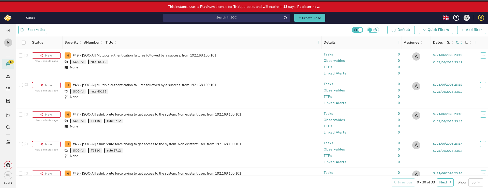

*Figure 28 — TheHive Cases list showing multiple open cases with Severity, Watcher, Title tabs; SSH brute-force and authentication failure incidents pending analyst review*

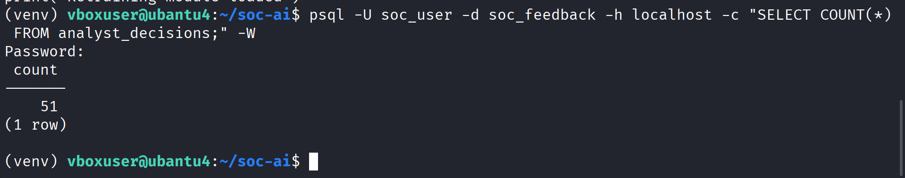

*Figure 29 — PostgreSQL on vm-ai SELECT COUNT(*) FROM analyst_decisions; result showing 51 decisions stored — milestone reached to enable XGBoost retraining*

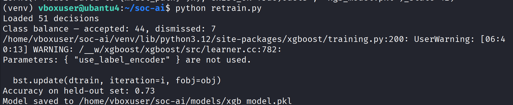

*Figure 30 — vm-ai terminal python retrain.py output: loaded 44 decisions, class balance shown, XGBoost training complete, accuracy 0.73, model saved to models/xgb_model.pkl*