# Phase 5: Production Hardening

**Window:** Week 2

**Goal:** Replace lab defaults and add baseline security controls before handling real traffic.

## Validation Steps

- Rotate default credentials across TheHive, Shuffle, PostgreSQL, Redis, and Elasticsearch.
- Enable Elasticsearch authentication and update dependent services.
- Place Kibana and TheHive behind Nginx with TLS.
- Create clean VM snapshots after all services pass health checks.

## Result

Default credentials were removed, xpack security was enabled, TLS proxies were configured, and snapshots were captured.

## Evidence Screenshots

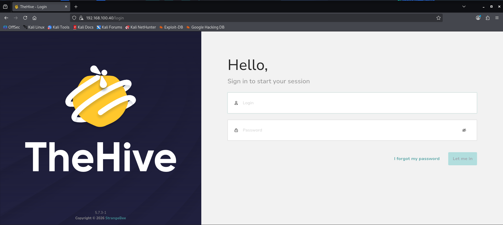

*Figure 31 — TheHive login page at 192.168.100.40:9000 confirming TheHive 5 is accessible after Phase 5 hardening with new analyst credentials*

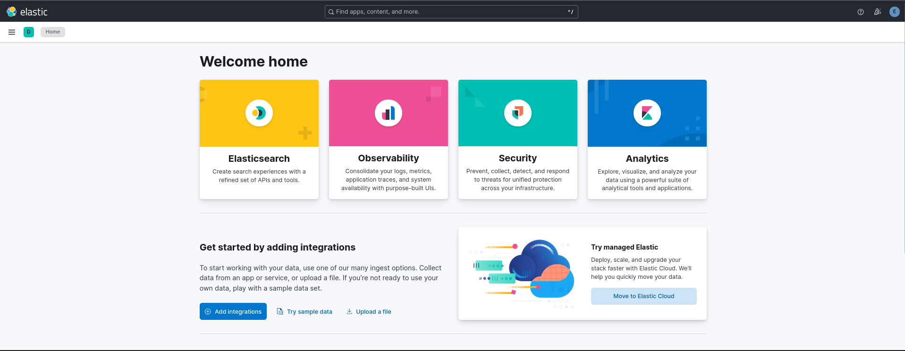

*Figure 32 — Kibana Welcome Home page at 192.168.100.20:5601 confirming Kibana is running and accessible*

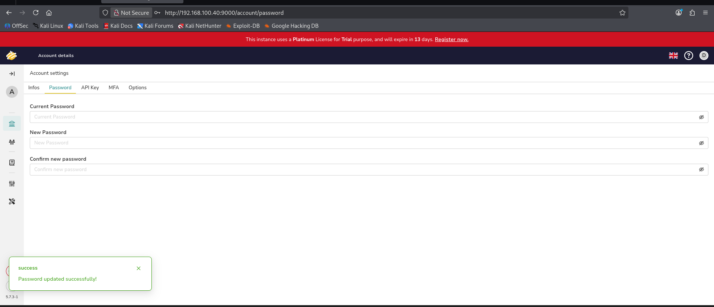

*Figure 33 — TheHive Account Settings page showing password change form with successful default credential rotation for admin account*

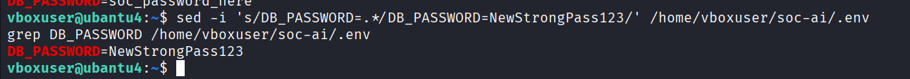

*Figure 34 — vm-ai terminal sed command updating DB_PASSWORD to NewStrongPass123 in /opt/soc-ai/.env file confirming PostgreSQL password rotation*

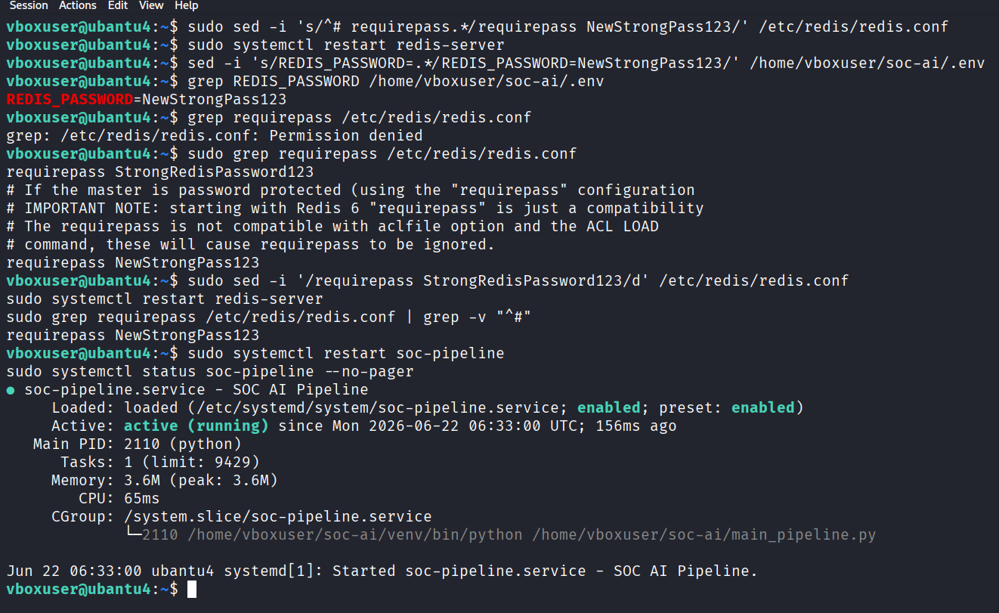

*Figure 35 — vm-ai terminal Redis requirepass update in /etc/redis/redis.conf, sed update of REDIS_PASSWORD in .env, systemctl restart redis-server and soc-pipeline confirmed*

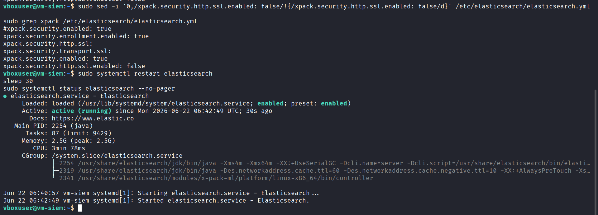

*Figure 36 — vm-siem terminal editing elasticsearch.yml to set xpack.security.enabled: true, then systemctl restart elasticsearch confirming service running with security enabled*

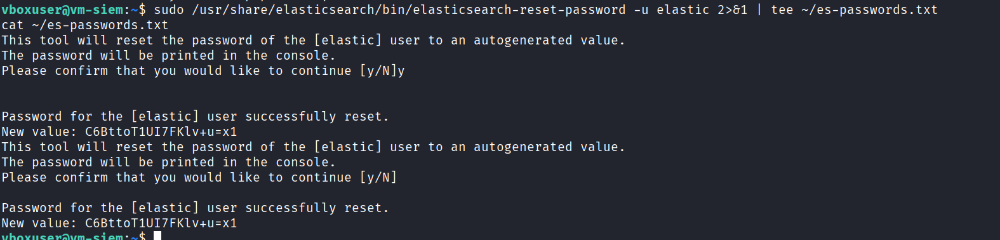

*Figure 37 — vm-siem terminal elasticsearch-reset-password command generating new password for elastic user, saved to es-passwords.txt for Logstash and pipeline config updates*

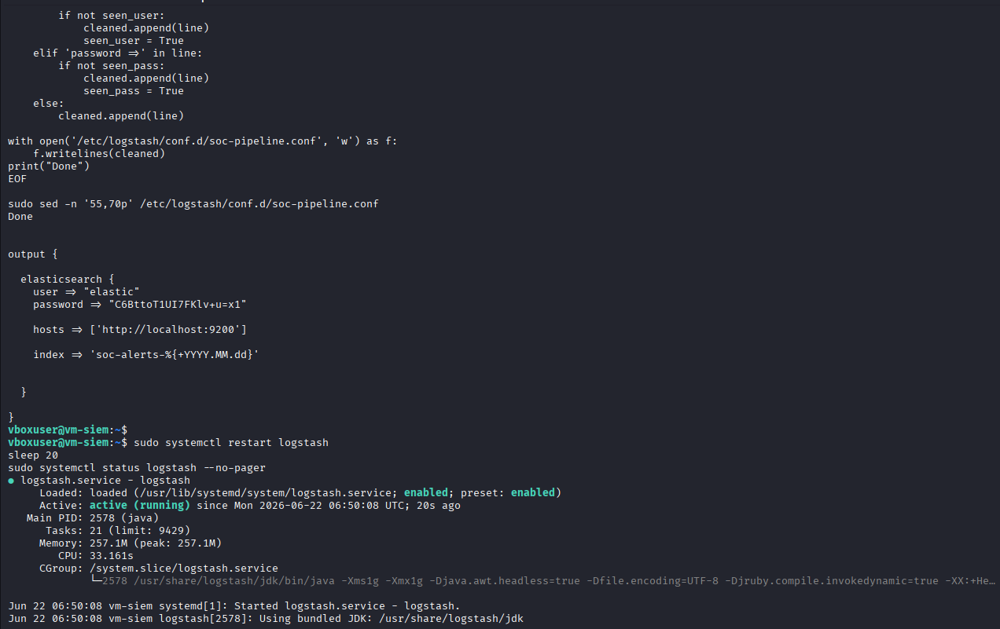

*Figure 38 — vm-siem terminal Python script updating Logstash soc-pipeline.conf with Elasticsearch credentials, then systemctl restart logstash confirming Logstash running with auth applied*

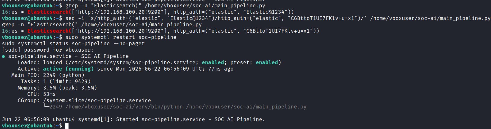

*Figure 39 — vm-ai terminal grep confirming Elasticsearch credentials updated in main_pipeline.py, systemctl restart soc-pipeline, status showing pipeline active/running with xpack auth now in effect*

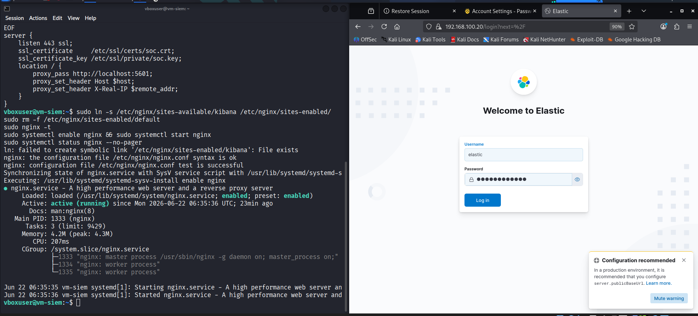

*Figure 40 — Split screen showing vm-siem terminal running Nginx TLS setup alongside browser showing Kibana HTTPS login page at 192.168.100.20*

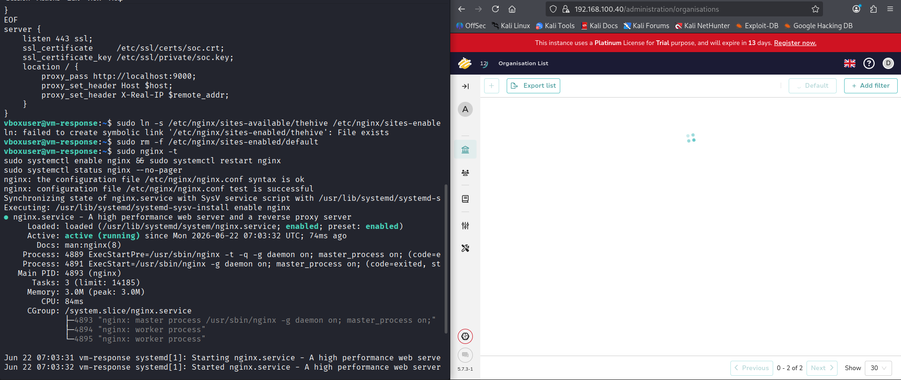

*Figure 41 — Split screen showing vm-response terminal running Nginx TLS config for TheHive alongside browser showing TheHive accessible via HTTPS at 192.168.100.40*

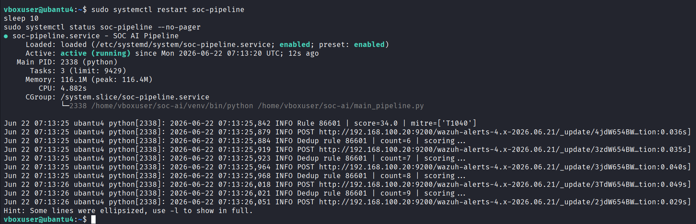

*Figure 42 — vm-ai terminal systemctl restart soc-pipeline, status confirming pipeline active/running, followed by live scoring logs showing pipeline processing alerts normally after all Phase 5 hardening applied*

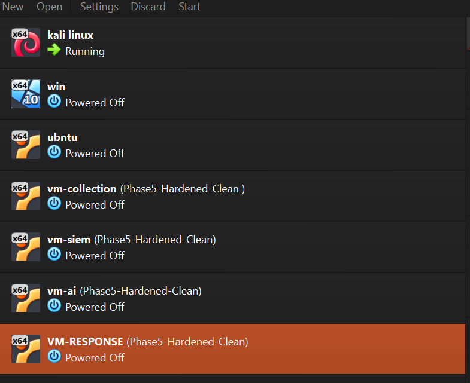

*Figure 43 — VirtualBox Manager showing all 4 VMs with Phase5-Hardened-Clean snapshots taken, confirming clean rollback point saved*