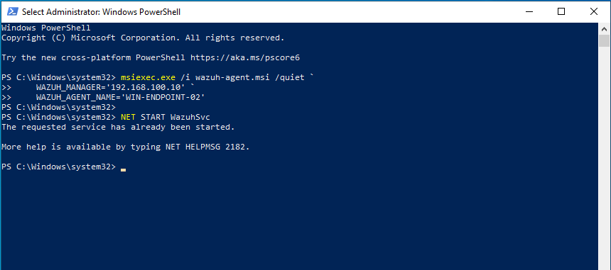
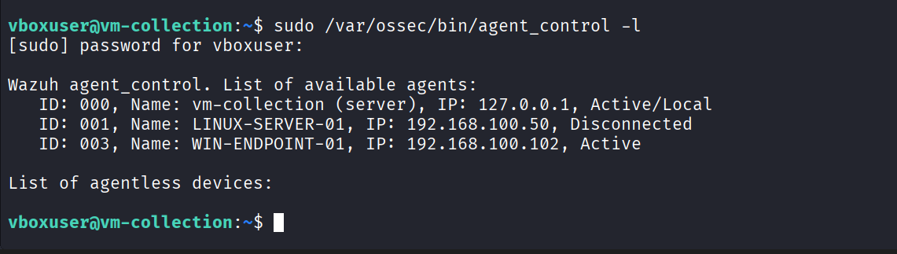
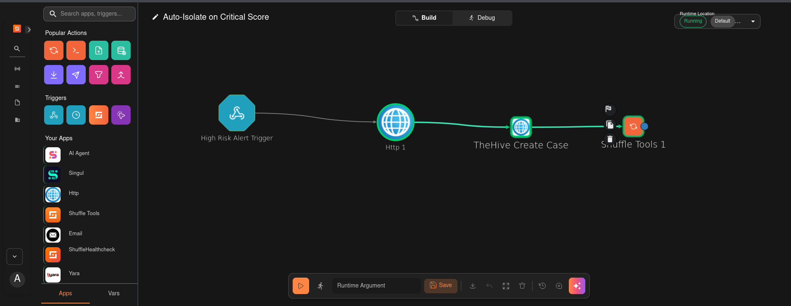
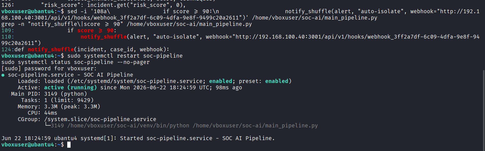
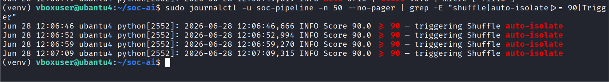
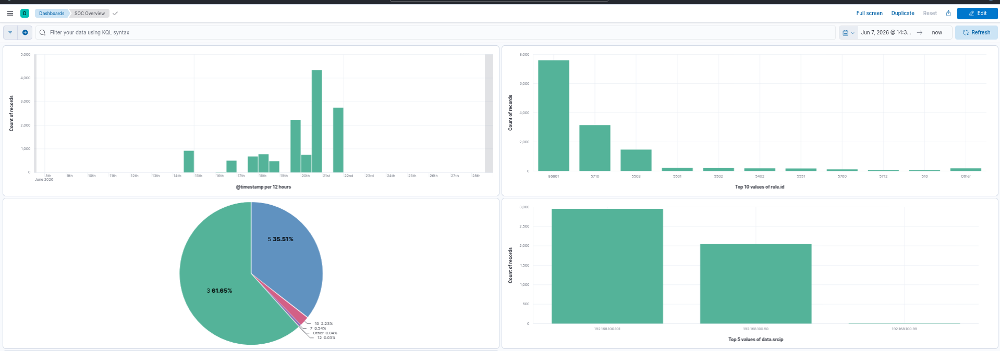

# Phase 6: Expanded Coverage

**Window:** Ongoing

**Goal:** Grow the lab into a richer SOC simulation with more endpoints, playbooks, and dashboards.

## Validation Steps

- Enroll a second Windows endpoint as a Wazuh agent.
- Create the high-risk Shuffle auto-isolate workflow.
- Validate Wazuh active response on score-90+ incidents.
- Build the live Kibana SOC overview dashboard.

## Result

The platform moved beyond a single alert path into multi-endpoint monitoring and critical-score automation.

## Evidence Screenshots

*Figure 44 — Windows PowerShell (Administrator) msiexec.exe command enrolling WIN-ENDPOINT-02 as a new Wazuh agent pointing to vm-collection (192.168.100.10); service started confirms registration*

*Figure 45 — vm-collection terminal agent_control -l listing all registered Wazuh agents: vm-collection (Active/Local), LINUX-SERVER-01 (Disconnected), WIN-ENDPOINT-01 (Active), WIN-ENDPOINT-02 (Active)*

*Figure 46 — Shuffle SOAR workflow editor showing Auto-Isolate on Critical Score playbook: High Risk Alert webhook trigger → HTTP Wazuh active response block IP → TheHive Create Case → Slack Notify*

*Figure 47 — vm-ai terminal main_pipeline.py updated with auto-isolate webhook call (notify_shuffle at score >= 90), systemctl restart soc-pipeline, status confirming pipeline active with auto-isolate logic live*

*Figure 48 — Kibana SOC Dashboard showing Alert Volume Over Time, Risk Score Distribution, Top Alert Types, and Alerts by Asset Tier panels populated with real data*